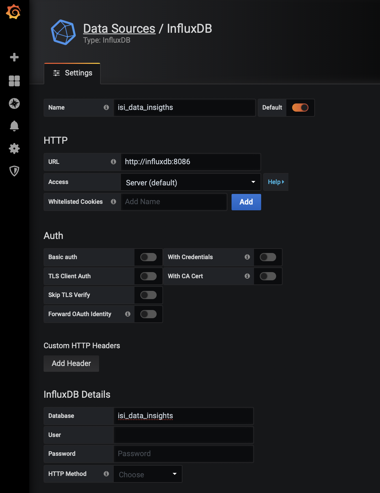
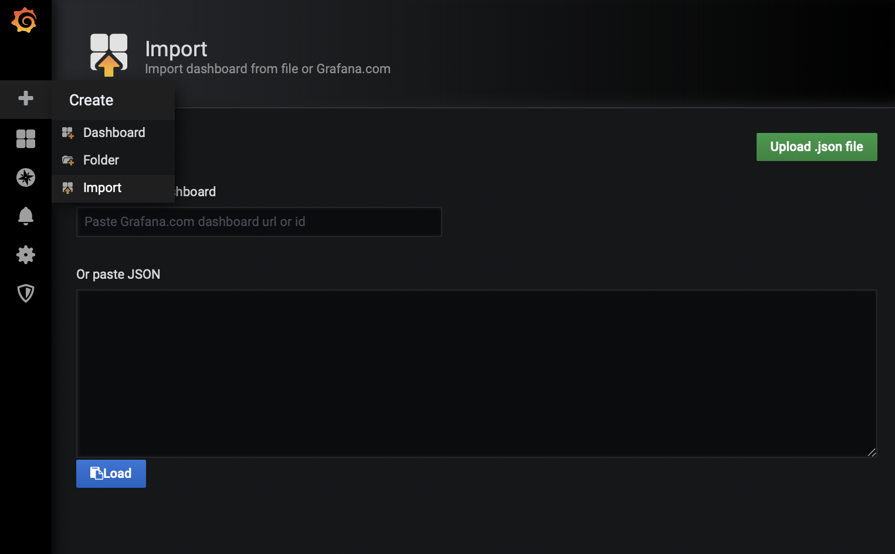

# GrafanaIQ

Quick example how to get [isilon_data_insights_connector](https://github.com/Isilon/isilon_data_insights_connector) up and running.

```bash
# Expecting that docker is already installed ...
# Create a singe node swarm to get features like configs and secrets.
docker swarm init

# Edit "clusters: " (line 24) in example config file and store it in docker swarm
docker config create example_config example_isi_data_insights_d.cfg

# Build connector
docker build --pull --rm -t isilon_data_insights_connector:latest "https://github.com/Dom-inik/isilon_data_insights_connector.git#dockerize"

# Deploy Stack
docker stack deploy -c docker-compose.yml GrafanaIQ
```

Access Grafana [http://localhost](http://localhost) using admin/admin

Add Datasource



Import Dashboards

